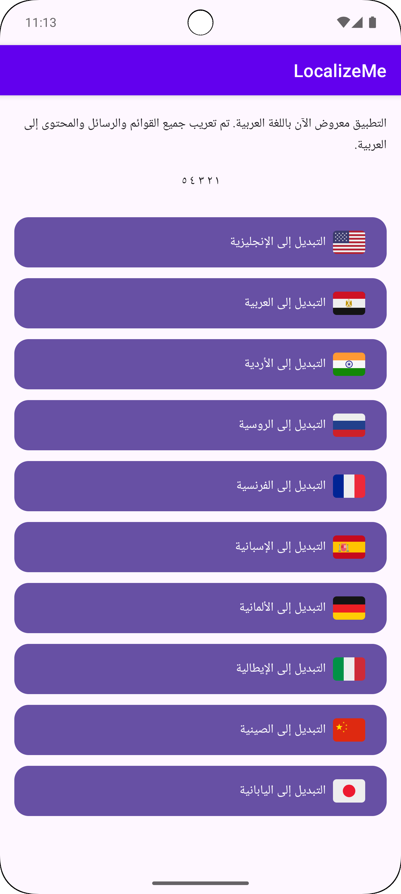
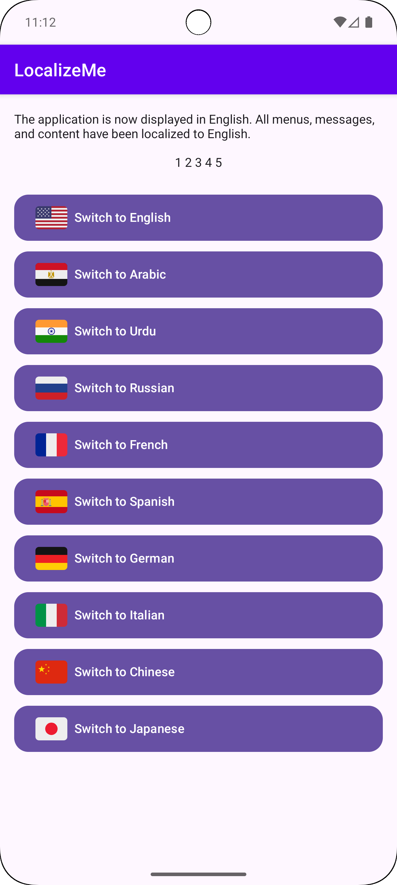
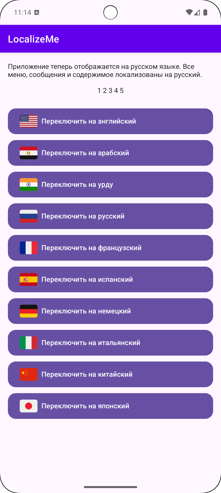
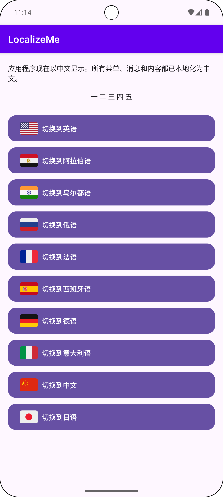

# LocalizeMe

[](https://jitpack.io/#hassanwasfy/LocalizeMe)

**LocalizeMe** is a lightweight Android library for managing **app localization**.  
It allows you to easily **switch languages at runtime**, supports multiple locales, and works with XML-based and compose resources.  

## Contents
- [Features](#Features)
- [Supported Locales](#Supported-Locales)
- [Demo](#Demo)
- [Screenshots](#Screenshots)
- [Installation](#Installation)
- [Usage](#Usage)
- [Advantages](#Advantages)
- [Contributions](#Contributions)

## Features

- Switch app language at runtime using `LanguageManager`.
- Supports **19+ languages** out of the box:
  
## Supported Locales

| Locale         | Tag   |
|----------------|-------|
| English        | en-US |
| Arabic (Egypt) | ar-EG |
| Urdu           | ur-PK |
| Russian        | ru-RU |
| French         | fr-FR |
| Spanish        | es-ES |
| German         | de-DE |
| Italian        | it-IT |
| Chinese        | zh-CN |
| Japanese       | ja-JP |
| Portuguese     | pt-BR |
| Hindi          | hi-IN |
| Turkish        | tr-TR |
| Persian        | fa-IR |
| Korean         | ko-KR |
| Bengali        | bn-BD |
| Indonesian     | id-ID |
| Malay          | ms-MY |
| Thai           | th-TH |

## Demo


The demo shows how the app switches languages.

## Screenshots

| Arabic Example | English Example | Russian Example | China Example |
|------------------|----------------|------------------|------------------|
|  |  |  |  |

## Installation

### Step 1: Add JitPack repository

```gradle
repositories {
    mavenCentral()
    maven { url 'https://jitpack.io' }
}
```

### Step 2: Add dependency

```gradle
dependencies {
    implementation("com.github.hassanwasfy:LocalizeMe:v1.0.13")
}
```

---

## Usage

add in `res/values/string.xml (any qualifer you target and we support)`
then use in code Like:

### 1- Use from list of buttons

```kotlin
import androidx.activity.ComponentActivity
import androidx.activity.compose.setContent
import androidx.compose.foundation.layout.*
import androidx.compose.material3.*
import androidx.compose.runtime.*
import androidx.compose.ui.Modifier
import androidx.compose.ui.unit.dp
import androidx.lifecycle.lifecycleScope
import com.hwasfy.localize.api.LanguageManager
import com.hwasfy.localize.util.SupportedLocales
import kotlinx.coroutines.launch
import java.util.*

class MainActivity : ComponentActivity() {

    @SuppressLint("UnusedMaterialScaffoldPaddingParameter")
    override fun onCreate(savedInstanceState: Bundle?) {
        super.onCreate(savedInstanceState)

        setContent {
            val currentLocale = currentAppLocale()

            Scaffold(
                modifier = Modifier.fillMaxSize(),
                topBar = {
                    TopAppBar(title = { Text("Language Demo") })
                }
            ) { padding ->
                Column(
                    modifier = Modifier
                        .fillMaxSize()
                        .padding(padding)
                        .padding(16.dp),
                    verticalArrangement = Arrangement.spacedBy(12.dp)
                ) {
                    Text("Current: ${currentLocale.name} (${currentLocale.locale.displayName})")

                    Button(
                        onClick = {
                            LanguageManager.setLanguage(
                                this@MainActivity,
                                SupportedLocales.EN_US
                            )
                        }
                    ) { Text("Switch to English") }

                    Button(
                        onClick = {
                            LanguageManager.setLanguage(
                                this@MainActivity,
                                SupportedLocales.AR_EG
                            )
                        }
                    ) { Text("التبديل إلى العربية") }

                    Button(
                        onClick = {
                            LanguageManager.setLanguage(
                                this@MainActivity,
                                SupportedLocales.FR_FR
                            )
                        }
                    ) { Text("Passer en Français") }
                }
            }
        }
    }
}
```

### 2- Use from ViewModel/Repository

```kotlin
class SettingsRepository(private val context: Context) {

    fun getCurrentLanguageCode(): String {
        return LanguageManager.getCurrentLanguage(context) // "en", "ar", ...
    }

    fun getCurrentLocale(): SupportedLocales {
        return LanguageManager.getCurrentLocale(context) // e.g., SupportedLocales.AR_EG
    }
}
```

### 3- Use from Composable

```kotlin
@Composable
fun LanguageInfo() {
    val code = currentAppLanguageCode()
    val locale = currentResolvedLocale()

    Column {
        Text("Language Code: $code")
        Text("Locale: ${locale.displayName}")
    }
}
```

---

## Advantages

- No complex setup required.
- Works with **XML-Compose resources**.
- Can be used in **any Android app**, just add dependency.
- Lightweight and modular, ready for Jitpack.

## Contributions

### Contributions are always welcome! If you'd like to contribute, please follow these steps:

- Fork the repository: Start by forking the `LocalizeMe` repository to your own GitHub account.
- Create a new branch: Create a new branch for your feature or bug fix. Use a descriptive name like `feature/add-new-locale` or `fix/crash-on-language-change`.
- Make your changes: Implement your changes and ensure the code follows the existing style and conventions.
- Create a pull request: Once your changes are ready, create a pull request (PR) from your forked repository to the main branch of the `original LocalizeMe repository`.
- Provide a clear description: In your PR, provide a detailed description of the changes you've made and the problem you're solving.

We appreciate your help in making this library even better!

